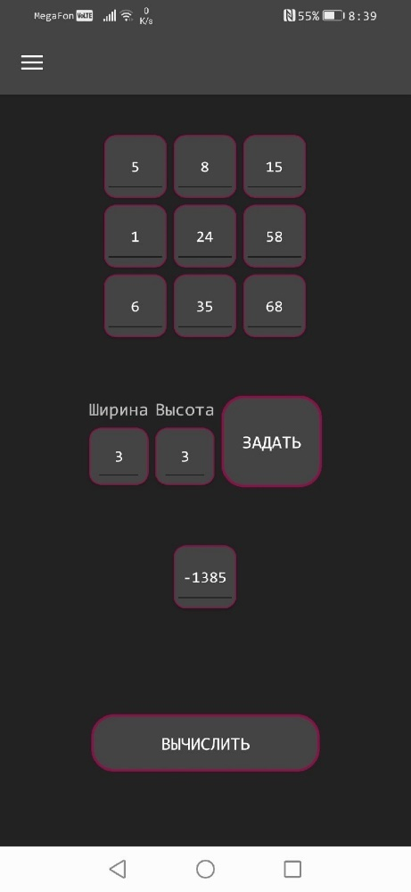
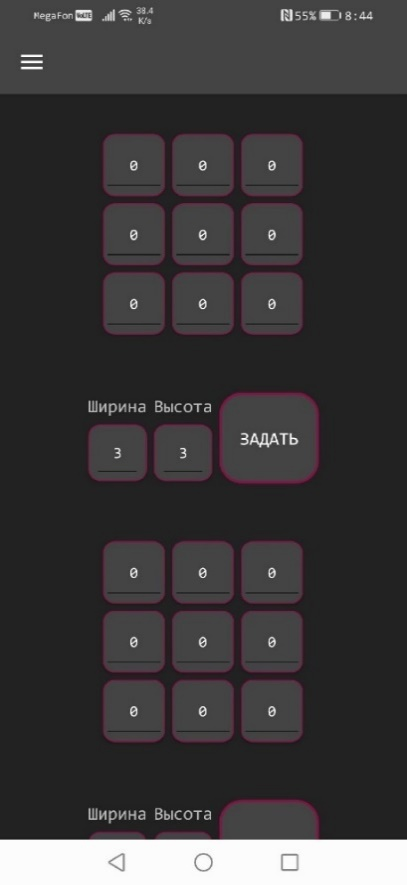

MatrixCalculator.XamarinForms
=============================

Мобильный фронтенд для матричного калькулятора

 

Функционал
----------

Приложение представляет из себя калькулятор для нескольких операций над
матрицами.

Калькулятор поддерживает следующие операции:

-   Сложение матриц

-   Вычитание матриц

-   Умножение матриц

-   Нахождение определителя

-   Нахождение обратной матрицы

Каждая операция на своей отдельной странице приложения.

Так выглядит страница нахождения определителя -

При нажатии на ячейку матрицы всплывает числовая клавиатура андроид. С помощью
нее вы можете ввести значение. При нажатии на кнопку “Вычислить” появляется
матрица или число с результатом. Чтобы вызвать меню выбора страницы нужно нажать
на значок в левом верхнем углу. Так выглядит меню выбора страницы.

Страницы с операциями над 2-мя матрицами выглядят так -

Проскролив вниз можно увидеть уже знакомую кнопку “Вычислить”.

Если во время вычислений произошла ошибка, то на месте результата появится
сообщение с ошибкой.

 

Инструкция по сборке
--------------------

Скачайте репозиторий с бизнес-логикой и добавьте папку рядом с текущим проектом

Репозиторий с бизнес-логикой: https://github.com/HexaLopata/MatrixCalculator.BL
